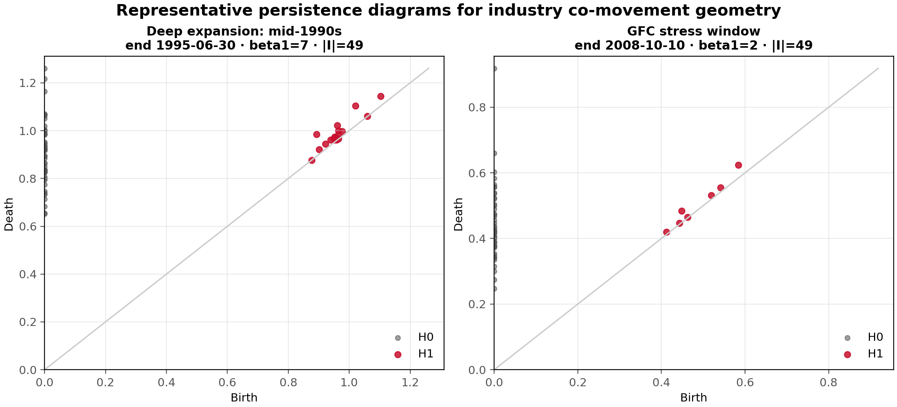
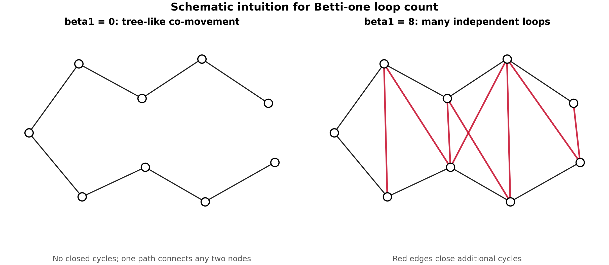
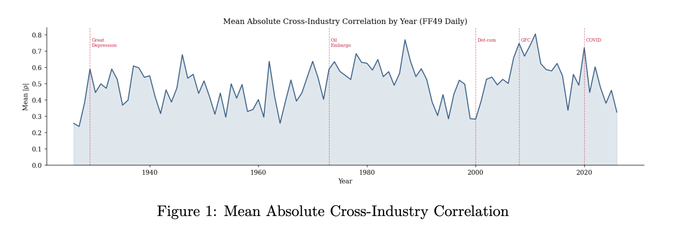
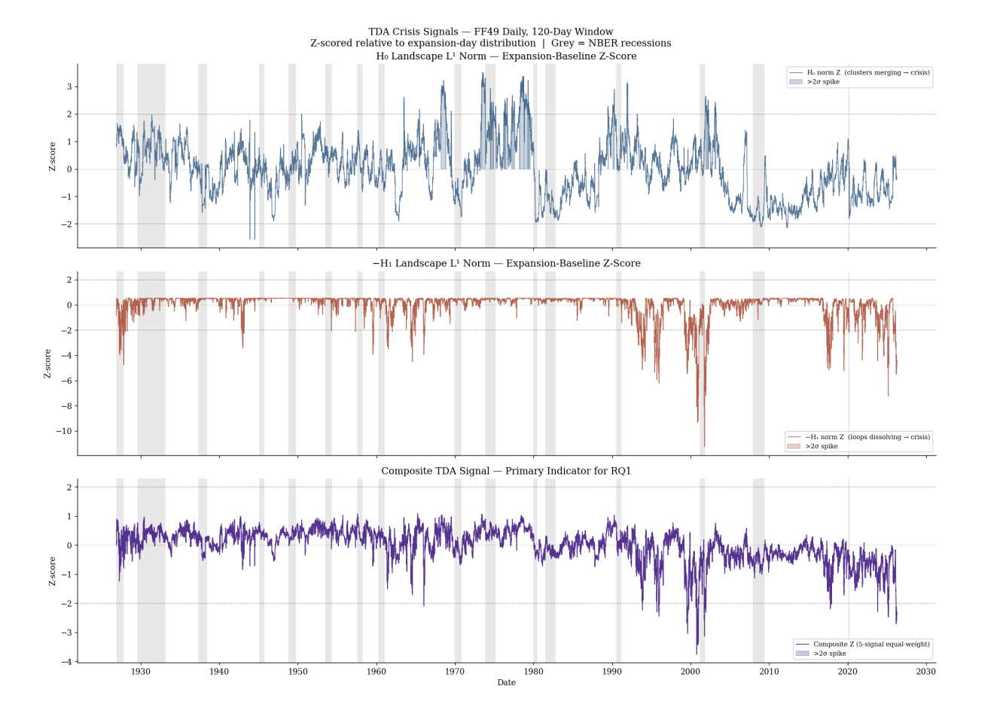
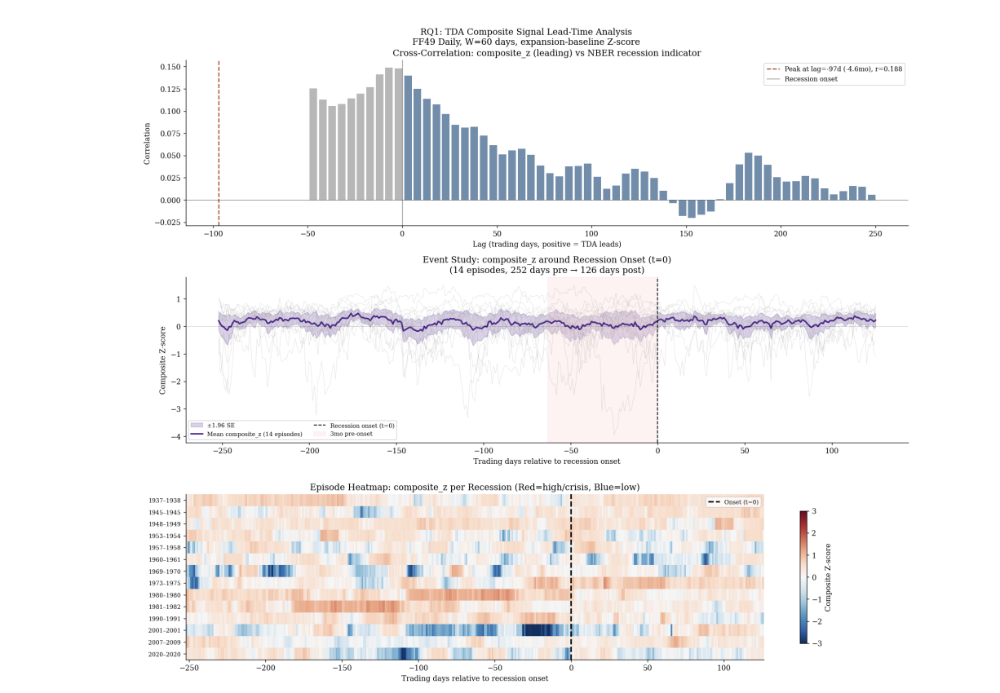
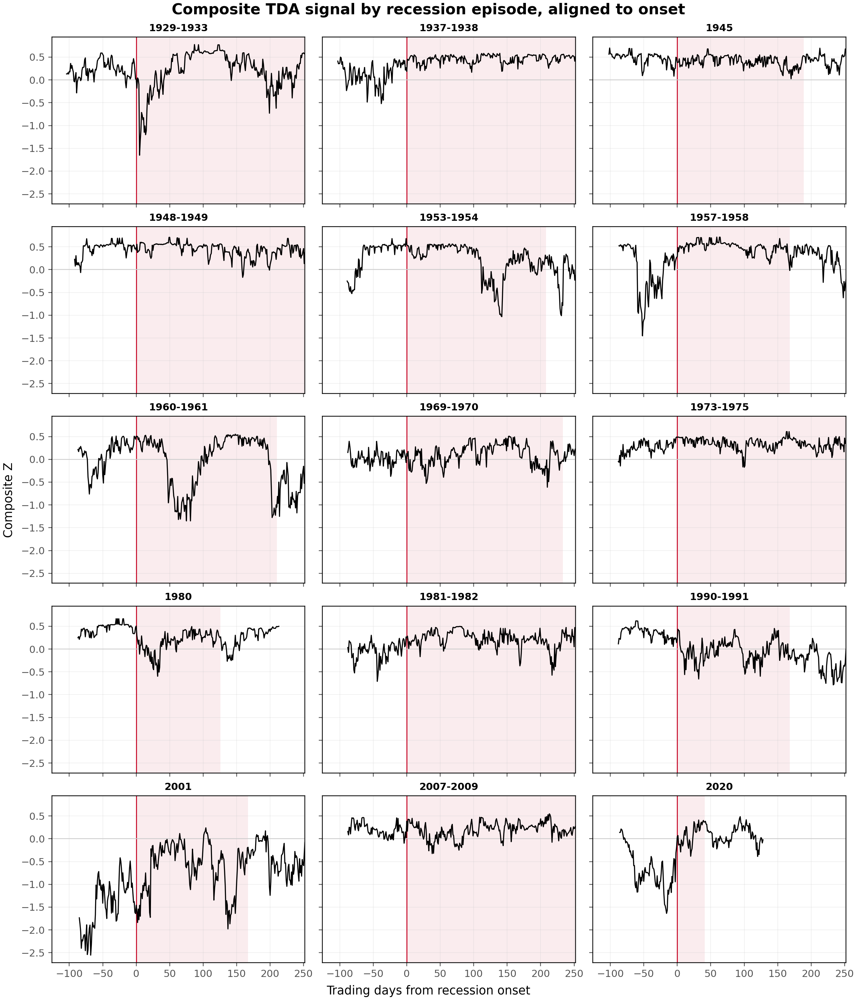
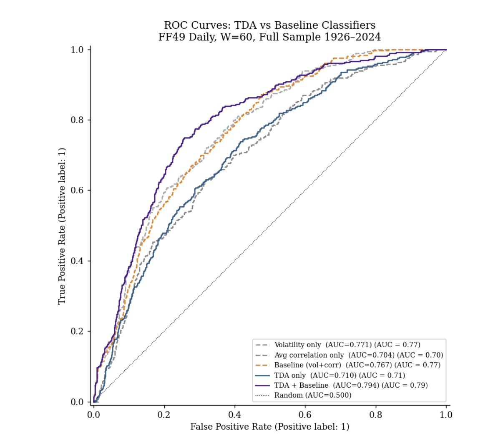
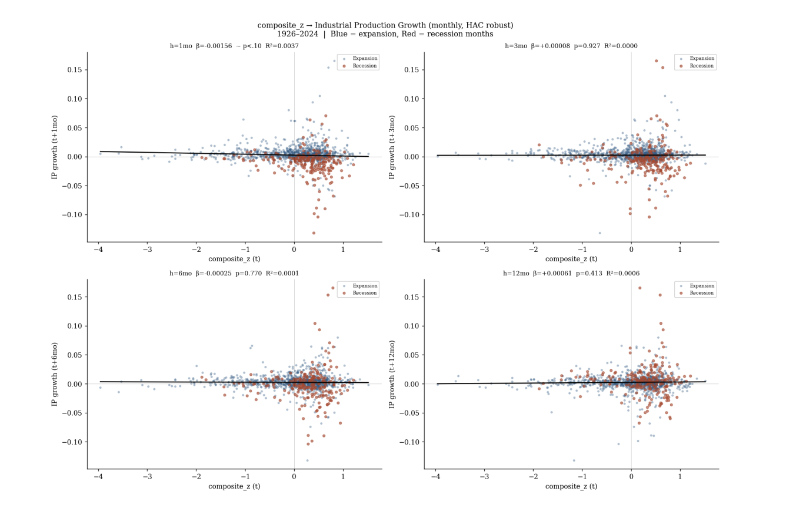
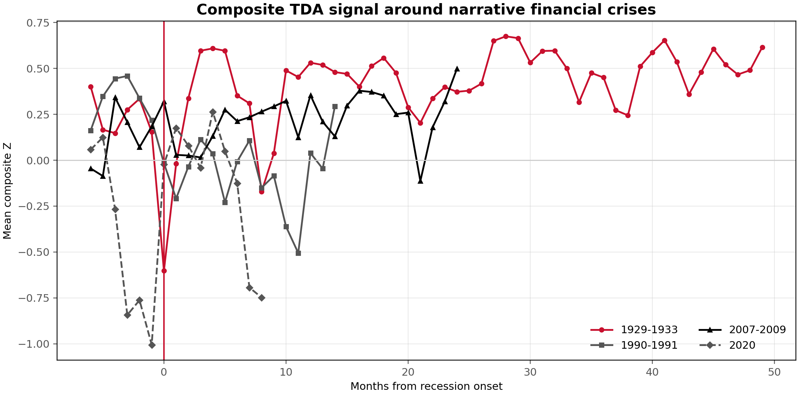

# Topological Early Warning Signals in U.S. Industry Portfolios: Preliminary Evidence from Daily Fama–French 49 Industries

**Nik Bear Brown · Milivoje Davidovic**

*Keywords: Topological data analysis · Persistent homology · Fama–French 49 industries · Recession regimes · Betti numbers · Persistence landscapes · Financial topology*

---

## Decision Needed from Milivoje Davidovic

Milivoje is the domain expert on the economics of the paper. The coding bottleneck is now mostly cleared: the TDA pipeline, robustness checks, missing-data sensitivity, cross-validation diagnostics, block-bootstrap tests, DeLong AUC comparisons, and composite-weighting sensitivity have all been run and added below. The main decision is now strategic rather than technical.

**Route A — Full paper for *Journal of Empirical Finance*.** Tighten the current version as a full empirical finance paper. Keep the robustness section, keep the negative/boundary macro result, and frame the contribution as a century-scale geometric characterization of industry co-movement regimes. This is the recommended default route if Milivoje wants the strongest finance-paper version.

**Route B — Short letter for *Finance Research Letters*.** Trim hard. Keep the main recession-topology result, the average-correlation residual test, and the most compact robustness table. Drop or move the macro-predictive and crisis-type material to an online appendix. This route is faster but leaves less room for the full robustness story.

**Route C — TDA/complex-systems paper for *Physica A*.** Emphasize topology, persistence diagrams, graph geometry, and financial-system structure. Keep the methodological exposition and visual material. This route fits the TDA-finance audience best, but the economics contribution should be framed less as finance identification and more as complex-system geometry.

**Decision requested:** Which route should govern the next revision? Once Milivoje chooses the route, the draft should be tightened toward that journal rather than trying to satisfy all three audiences at once.

---

## Abstract

This paper applies persistent homology to daily Fama–French 49 industry portfolio returns over the period July 1926–March 2026 to characterize how the topology of industry co-movement evolves across NBER recession and expansion regimes. Using 60-trading-day rolling Vietoris–Rips filtrations on correlation-distance matrices, I construct five oriented topological signals — H0 and H1 landscape norms, the inverse Betti-one count, and total persistence for H0 and H1 — and combine them into a composite recession-topology indicator. The central finding is that industry co-movement topology simplifies during recessions: loop structure collapses, as measured by a statistically significant decline in β1 (Cohen's *d* = 0.382, block-bootstrap *p* < 0.001), and the composite topological signal is meaningfully elevated in recession windows relative to expansions (Cohen's *d* = 0.481, block-bootstrap *p* < 0.001). Cross-validated recession classification using TDA alone yields AUC = 0.559, below a simple volatility-plus-returns benchmark (AUC = 0.773), and TDA does not add incremental classification power over conventional signals. The topological signal is not merely average correlation in disguise: after residualizing composite Z on mean absolute correlation, the residual still predicts recession-regime membership (Cohen's *d* = 0.288, block-bootstrap *p* = 0.025). The contribution is a geometric characterization of recession-regime co-movement structure, not a forecasting system.

---

## 1. Introduction

The behavior of asset return correlations across economic regimes has been extensively studied, but the *shape* of dependence structure — the topology of how industries relate to one another as a system — has received comparatively little attention. Standard measures such as average pairwise correlation or rolling covariance summarize the strength of co-movement but discard information about its geometric organization. Two industry systems can have identical average correlations and radically different topological structures: one fragmented into isolated clusters, another organized around a small number of interconnected hubs, a third characterized by pervasive loop-like dependencies.

Topological data analysis (TDA), and persistent homology in particular, offers tools for extracting this shape information from high-dimensional data. Applied to financial returns, TDA constructs a sequence of simplicial complexes from distance matrices and tracks the birth and death of topological features — connected components (H0) and independent loops (H1) — across filtration scales. The resulting persistence barcodes and landscape summaries carry information about co-movement geometry that is invisible to scalar correlation measures.

Prior work has demonstrated TDA's sensitivity to financial crises in equity index data (Gidea and Katz 2018), bubble formation (Akingbade et al. 2024), and general financial time series (Edelsbrunner and Harer 2010). Most of this literature studies index-level dynamics, short crisis windows, or lower-frequency financial series. It has not established whether persistent homology reveals systematic business-cycle structure in a broad cross-section of industries over a century of daily observations. The present paper extends the TDA-finance literature to the cross-sectional industry dimension, using the Fama-French 49 daily panel as the empirical foundation. Three questions motivate the analysis.

First, does industry co-movement topology exhibit systematic differences between NBER recession and expansion regimes? Second, if such differences exist, do they provide incremental recession-classification power beyond conventional risk signals? Third, does topology carry information beyond average cross-industry correlation?

The answers are: yes to the first, no to the second, and weakly suggestive to the third. Together, these findings support characterizing TDA as a geometric descriptor of recession-regime structure rather than as a superior forecasting device.

The paper makes three contributions. First, it documents a century-scale empirical regularity: U.S. industry co-movement topology simplifies during NBER recessions, with loop structure and total persistence compressing in recession windows. Second, it shows that this topological signal is not exhausted by average pairwise correlation; residual topology after removing mean absolute correlation remains associated with recession regimes. Third, it establishes a boundary condition for the method: TDA is informative as regime characterization, but it does not beat simple volatility-return benchmarks as a recession classifier and does not provide reliable macro-predictive content for industrial production.

The contribution sits between three literatures. Relative to TDA-finance work, especially Gidea and Katz (2018) and Akingbade et al. (2024), the paper changes the object of study from a small set of market-index time series and bubble/crash episodes to a long daily panel of industry portfolios across all NBER recessions in the sample. Relative to correlation-network systemic-risk work such as Puliga, Caldarelli, and Battiston (2014), the paper keeps the network intuition but measures higher-order shape through persistent homology rather than pairwise network summaries alone. Relative to the older finance and macro literatures on conditional correlation and business-cycle co-movement, including Longin and Solnik (2001), Stock and Watson (1990), and Hornstein and Praschnik (1997), the paper asks whether recession co-movement has a geometric structure beyond the fact that correlations rise in bad times.

The remainder of the paper is organized as follows. Section 2 describes the data and topological measurement methodology. Section 3 presents descriptive evidence. Section 4 reports estimation evidence on timing and classification. Section 5 tests whether the topological signal is distinct from average correlation and explores crisis-type heterogeneity. Section 6 consolidates robustness and specification checks. Section 7 discusses limitations and next steps. Section 8 concludes.

---

## 2. Data and Methodology

### 2.1 Data

The empirical analysis uses daily value-weighted returns for the Fama–French 49 industry portfolios, obtained from Kenneth French's data library. The sample spans July 1, 1926 through March 31, 2026, yielding a raw panel of 26,212 trading days × 49 industries.

**Coverage and missing data.** Total missing entries number 67,250; seven industries exceed a 5% missing-value rate. No industry exceeds 10% zero-return frequency in the full sample. Coverage by decade rises from approximately 83% in the 1920s and 87–88% in the 1930s–1950s to 94% in the 1960s, reaching 100% from the 1970s onward. This uneven coverage introduces measurement heterogeneity in the early sample that is addressed in robustness checks (Section 6): dropping the seven high-missing industries, distance-weighted KNN imputation, and pooled MICE imputation all preserve the sign and significance of the composite recession effect, though the imputed panels attenuate its magnitude.

**Recession indicator.** NBER recession dates are converted to daily frequency using the standard peak-to-trough convention. The sample covers 15 recession episodes.

### 2.2 Topological Measurement

**Rolling correlation-distance matrices.** For each trading day *t*, I compute the cross-industry correlation matrix over a rolling window of *W* = 60 trading days. The correlation matrix is converted to a distance matrix using the standard transformation *d*(*i*, *j*) = √(2(1 − ρ*ij*)), which preserves metric properties and maps correlation to Euclidean-compatible distances on [0, 2].

The choice of *W* = 60 is motivated by a window-comparison exercise: among windows of 60, 120, and 252 trading days, the 60-day window maximizes mean positive effect size for the recession-regime comparison. Longer windows are examined in robustness analysis.

**Vietoris-Rips filtration intuition.** Each rolling window produces a cloud of 49 industries in correlation-distance space. Industries that move similarly are close; industries that move differently are far apart. A Vietoris-Rips filtration asks what the industry network looks like as the distance threshold gradually increases. At very small thresholds, industries are isolated. As the threshold grows, close industries connect into components; triangles and higher-order simplices fill in; loops appear and then disappear. A recession changes not only the average distance among industries but the order in which these connections, holes, and filled-in regions emerge. Persistent homology records that changing geometry.

**Persistent homology.** For each rolling window, I apply Vietoris-Rips persistent homology using the Ripser algorithm (Bauer 2021), computing H0 (connected components) and H1 (independent loops) up to dimension 1. The output is a persistence barcode — a multiset of intervals [*b*, *d*] recording the filtration values at which each topological feature is born and dies.

*Method Figure 1: Representative Persistence Diagrams*

*Method Figure 2: β1 Loop-Count Schematic*

**Topological summaries.** From each barcode I extract five scalar summaries:
- *H0 landscape L¹ norm*: the L¹ norm of the H0 persistence landscape (Bubenik 2015), measuring the overall persistence of connected components.
- *H1 landscape L¹ norm*: the analogous quantity for H1 (loop structure).
- *β1*: the raw Betti-one count, i.e., the number of independent loops alive at a representative filtration threshold.
- *Total persistence H0* and *Total persistence H1*: the sum of (death − birth) lengths across all H0 and H1 features, respectively.

Formally, a persistence landscape maps each persistence interval [*b*, *d*] to a triangular tent function with peak at (*b* + *d*) / 2 and height (*d* − *b*) / 2; the ordered sequence of these tent functions across intervals defines the landscape layers λₖ(*t*) (Bubenik 2015). I use the L¹ norm of the landscape as a scalar summary of the amount of persistent topological structure in each dimension.

**Orientation and standardization.** Each signal is oriented so that higher values correspond to more crisis-like topology. The H0 landscape norm is used directly (more components → higher fragmentation). The H1 landscape norm, β1, and both total persistence measures are negated, so that loop collapse — the recession pattern — produces upward movement. All signals are standardized to the expansion-day distribution (mean 0, standard deviation 1 on expansion days). The **composite topological signal Z** is the equal-weighted average of the five oriented, standardized components. Equal weighting is used as the transparent baseline because the five components are not trained to optimize a forecasting objective; weighting them by fitted recession performance would risk turning a descriptive regime measure into an in-sample classifier. As sensitivity checks, I also construct two unsupervised alternatives: the first principal component of the expansion-day component matrix and a Ledoit-Wolf covariance-stabilized minimum-variance composite.

---

## 3. Descriptive Evidence

### 3.1 Time-Series Behavior of Co-movement

Figure 1 plots the mean absolute cross-industry correlation by year. The series exhibits substantial time variation: peaks coincide with the Great Depression, the 1970s oil shocks, the Global Financial Crisis, and the COVID-19 shock, while the postwar expansion period and the 1990s bull market correspond to lower average co-movement. This variation motivates the topological approach: average correlation captures the *intensity* of co-movement, while persistent homology targets its *shape*.

*Figure 1: Mean Absolute Cross-Industry Correlation*

### 3.2 Topological Signals and Recession Regimes

Table 1 reports expansion means, recession means, Cohen's *d*, and block-bootstrap *p*-values for each topological signal. The H0 landscape norm is lower in recessions (*d* = −0.535), so recession topology is not a simple fragmentation story. The loop-collapse and persistence-compression signals are uniformly positive. The inverse H1 landscape norm (*d* = 0.412), inverse β1 (*d* = 0.382), inverse total persistence H0 (*d* = 0.653), and inverse total persistence H1 (*d* = 0.471) are all significant under a 252-trading-day block bootstrap. The composite signal achieves *d* = 0.481.

**Table 1: Recession vs. Expansion Differences in Topological Signals**

| Signal | Expansion mean | Recession mean | Cohen's *d* | Block-bootstrap *p*-value | Read |
|---|---|---|---|---|---|
| H0 landscape L¹ | 0.000 | −0.523 | −0.535 | <0.001 | Opposite sign |
| −H1 landscape L¹ | 0.000 | 0.391 | 0.412 | <0.001 | Significant |
| −β1 | 0.000 | 0.364 | 0.382 | <0.001 | Loop collapse |
| −TP H0 | 0.000 | 0.640 | 0.653 | <0.001 | Strongest component |
| −TP H1 | 0.000 | 0.446 | 0.471 | <0.001 | Significant |
| Composite Z | 0.000 | 0.264 | 0.481 | <0.001 | Main signal |

*Notes: All signals standardized on expansion days. Larger values indicate more crisis-like topology except the raw H0 landscape component, which is retained to show that fragmentation is not the recession pattern in this specification. Block-bootstrap tests use 252-trading-day blocks.*

Composite weighting does not drive the result. The equal-weight baseline is positive and significant, while the PCA-weighted composite is stronger and the shrinkage-weighted composite remains positive. PCA improves separation largely because it assigns negative weight to the H0 fragmentation component — which empirically has the opposite recession sign — and positive weight to the loop and persistence-compression components.

**Table 1b: Composite-Weighting Sensitivity**

| Composite | Cohen's *d* | AUC | Block-bootstrap *p*-value | Read |
|---|---:|---:|---:|---|
| Equal-weight baseline | 0.481 | 0.660 | <0.001 | Transparent main specification |
| PCA PC1 | 0.567 | 0.685 | <0.001 | Stronger unsupervised composite |
| Ledoit-Wolf min-var | 0.480 | 0.640 | 0.022 | Positive, noisier rank separation |

*Figure 2: TDA Crisis Signals Across Recession Regimes*

The dominant pattern is topological compression, not fragmentation. During recessions, the number and persistence of independent loops in the industry co-movement graph falls — industries move together in a simpler, more tree-like structure, with fewer independent cycles of partial co-movement. The β1 collapse is the most interpretable component of this simplification; total-persistence compression is the largest component statistically.

---

## 4. Estimation Evidence

### 4.1 Timing: Does TDA Lead Recessions?

Figure 3 plots the cross-correlation function between the composite topological signal and the NBER recession indicator at leads of up to 250 trading days, alongside an event-study plot aligned to recession onset. The cross-correlation profile shows a small positive-lag association at approximately 31 trading days (correlation ≈ 0.10), but the stronger signal is contemporaneous or post-onset. The event-study confirms: the composite Z begins rising modestly in the weeks before recession onset but the bulk of the elevation occurs during, not before, the recession window.

*Figure 3: Composite TDA Signal Lead-Time Analysis*

*Figure 4: Episode-Aligned Composite TDA Signal*

This pattern rules out the TDA signal as a long-lead recession predictor. The appropriate characterization is a regime descriptor, not an early warning indicator in the forecasting sense.

### 4.2 Classification: Can TDA Identify Recession Regimes?

Table 2 reports expanding-window cross-validated AUC for recession classification using only information available at each test date. The best naive benchmark — volatility plus lagged returns — achieves pooled AUC = 0.773. TDA alone achieves pooled AUC = 0.559, above random but substantially weaker than the naive benchmark. Adding TDA to the full naive suite produces pooled AUC = 0.716, still below the best naive model. Paired DeLong tests confirm that both TDA-only and TDA-plus-all are significantly below the best naive benchmark (*p* < 0.001). This result narrows the claim: the topological signals describe recession-regime geometry, but they do not improve recession classification once conventional return and volatility information is available.

*Figure 5: ROC Curves for TDA and Baseline Recession Classifiers*

**Table 2: Expanding-Window Cross-Validated AUC for Recession Classification**

| Model | Pooled AUC | Fold mean AUC | Fold SD | Δ vs. best naive |
|---|---:|---:|---:|---:|
| Naive: volatility + returns | 0.773 | 0.768 | 0.127 | 0.000 |
| TDA only | 0.559 | 0.628 | 0.152 | −0.214 |
| TDA + volatility + returns + correlation | 0.716 | 0.764 | 0.121 | −0.057 |

*Notes: Classification uses expanding-window time-series CV with non-overlapping five-year test blocks beginning in 1975. Topological features are standardized using an expanding expansion-day baseline available before each test date. DeLong paired AUC tests versus the best naive model reject equality for TDA-only (ΔAUC = −0.214, *p* < 0.001) and TDA-plus-all (ΔAUC = −0.057, *p* < 0.001).*

The classification evidence is unambiguous: TDA captures a statistically meaningful recession-regime geometry, but it does not add incremental classification power beyond simple volatility-return information available at the same point in time.

### 4.3 Boundary Result: Does TDA Forecast Economic Activity?

Table 3 reports OLS predictive regressions of future industrial production growth on the composite topological signal at horizons of 1, 3, 6, and 12 months, alongside comparable regressions for 60-day volatility and lagged monthly returns. Standard errors are Newey–West HAC throughout. I report these regressions as a boundary result rather than a separate contribution: they test what the topological signal does *not* do.

*Figure 6: Composite TDA Signal and Future Industrial-Production Growth*

**Table 3: Predictive Regressions for Industrial Production Growth**

| Predictor | Horizon | β | *t*-stat | *p*-value | *R²* |
|---|---|---|---|---|---|
| Composite Z | 1 month | −0.00156 | −1.851 | 0.064 | 0.004 |
| Composite Z | 3 months | 0.00008 | 0.091 | 0.927 | 0.000 |
| Composite Z | 6 months | −0.00025 | −0.292 | 0.770 | 0.000 |
| Composite Z | 12 months | 0.00061 | 0.819 | 0.413 | 0.001 |
| Monthly return | 1 month | 0.00092 | 2.820 | 0.005 | 0.088 |
| Monthly return | 3 months | 0.00030 | 3.347 | 0.001 | 0.010 |

*Selected rows shown. Full table includes volatility at all horizons.*

The composite topological signal is borderline significant at the one-month horizon (*p* = 0.064) and insignificant at all longer horizons. The lagged monthly return, by contrast, is significant at one and three months and explains substantially more variance. The macro-predictive case for TDA is not established, so the industrial-production regressions should be read as a negative result: the topology measure characterizes financial co-movement regimes; it does not reliably forecast subsequent real activity in this specification.

---

## 5. What Topology Adds

### 5.1 Distinctness from Average Correlation

The central identification question is whether persistent homology is capturing shape information beyond average co-movement intensity. To test this, I regress the composite topological signal on mean absolute cross-industry correlation and examine whether the residual still separates recession from expansion days.

The answer is yes, but with an important qualification. Composite Z and mean absolute correlation are positively related (correlation = 0.520), and mean absolute correlation explains 27.0% of composite-Z variation. This confirms that a large share of the topological signal is connected to conventional co-movement intensity. However, the residual topological signal remains elevated in recessions (Cohen's *d* = 0.288), with a block-bootstrap *p*-value of 0.025. Mean absolute correlation alone achieves AUC = 0.628 for recession-regime classification; composite Z achieves AUC = 0.660; and adding the TDA residual to a mean-correlation logit increases AUC from 0.628 to 0.674.

**Table 4: TDA Distinctness from Mean Absolute Correlation**

| Metric | Value |
|---|---:|
| Corr(composite Z, mean absolute correlation) | 0.520 |
| R² from composite Z ~ mean absolute correlation | 0.270 |
| Residual recession Cohen's *d* | 0.288 |
| Residual block-bootstrap *p*-value | 0.025 |
| AUC: mean absolute correlation | 0.628 |
| AUC: composite Z | 0.660 |
| AUC: mean correlation + TDA residual | 0.674 |

This result is the strongest incremental evidence in the current draft. It does not imply that topology dominates correlation; it does not. It implies that persistent homology decomposes co-movement geometry in a way that is related to, but not exhausted by, average correlation. That is the contribution claim the evidence can support.

### 5.2 Crisis-Type Heterogeneity

I also test whether the composite topological signal behaves differently across crisis types. The narrative financial-crisis set contains four episodes: the Great Depression, the 1990-1991 recession associated with the savings-and-loan/credit cycle, the Global Financial Crisis, and the COVID recession. Figure 7 plots the composite signal in monthly bins around those four recession onsets.

*Figure 7: Composite TDA Signal Around Narrative Financial Crises*

**Table 5: Financial-Crisis Heterogeneity Tests**

| Test | Financial mean | Other mean | Difference | Cohen's *d* | *p*-value |
|---|---:|---:|---:|---:|---:|
| Recession-day composite Z | 0.312 | 0.233 | 0.079 | 0.225 | <0.001 |
| Recession-day composite Z after residualizing volatility | −0.014 | 0.009 | −0.024 | −0.070 | 0.017 |
| Episode-level elevation vs. pre-recession | 0.112 | 0.159 | −0.047 | −0.125 | 0.834 |

The crisis-type evidence is not strong enough to carry a central claim. Financial-crisis recession days have slightly higher composite Z than other recession days, but the difference is small and reverses after residualizing 60-day volatility. At the episode level, where the effective sample size is the correct scale for this question, financial-crisis elevation is not larger than other recession types. This is a useful negative result: the current paper can say that recession topology simplifies broadly, but it should not claim that the effect is uniquely or reliably financial-crisis-specific.

The figure remains useful because it shows what the method sees in named episodes. The Great Depression and GFC display persistent positive topological elevation after onset. The 1990-1991 recession and COVID episode are shorter and less stable. Supply/monetary episodes are also uneven: some, especially 1973-1975 and 1981-1982, show persistent positive topology, while 1969-1970 and 1980 do not. That null pattern matters. It means the recession topology measured here is not a universal response to any macro contraction; it is strongest when the recession reorganizes the cross-sectional structure of industry co-movement. The heterogeneity is real visually, but not yet statistically disciplined enough to become a headline result.

---

## 6. Robustness and Specification Checks

This section collects the new robustness analyses so the paper's empirical status is visible in one place. The core result is stable: recession windows are associated with topological compression, especially in loop and persistence-related summaries. The strength of the effect varies with window length, sample coverage, missing-data handling, and composite weighting, but the qualitative recession-regime pattern does not disappear.

### 6.1 Rolling-Window Robustness

The baseline uses a 60-trading-day rolling window because it is the most responsive short-horizon specification and produces the strongest mean positive recession effect across the component signals. I re-run the full TDA pipeline at 120 and 252 trading days. Longer windows smooth regime transitions and attenuate the composite signal, but the direction of the main loop-collapse and persistence-compression effects remains positive.

**Table 6: Rolling-Window Robustness, W = 60, 120, 252**

| Window | Signal | Cohen's *d* | AUC | Read |
|---:|---|---:|---:|---|
| 60 | H0 landscape L¹ | −0.535 | 0.346 | Opposite sign |
| 60 | −H1 landscape L¹ | 0.412 | 0.649 | Positive |
| 60 | −β1 | 0.382 | 0.610 | Positive loop collapse |
| 60 | −TP H0 | 0.653 | 0.691 | Strongest component |
| 60 | −TP H1 | 0.471 | 0.653 | Positive |
| 60 | Composite Z | 0.481 | 0.660 | Baseline |
| 120 | H0 landscape L¹ | −0.554 | 0.339 | Opposite sign |
| 120 | −H1 landscape L¹ | 0.336 | 0.619 | Positive |
| 120 | −β1 | 0.311 | 0.578 | Positive loop collapse |
| 120 | −TP H0 | 0.673 | 0.701 | Strongest component |
| 120 | −TP H1 | 0.409 | 0.625 | Positive |
| 120 | Composite Z | 0.410 | 0.631 | Attenuated |
| 252 | H0 landscape L¹ | −0.403 | 0.375 | Opposite sign |
| 252 | −H1 landscape L¹ | 0.194 | 0.602 | Positive |
| 252 | −β1 | 0.324 | 0.586 | Positive loop collapse |
| 252 | −TP H0 | 0.514 | 0.667 | Strongest component |
| 252 | −TP H1 | 0.283 | 0.605 | Positive |
| 252 | Composite Z | 0.318 | 0.613 | Attenuated |

The β1-collapse component remains positive across all three windows, but it is not the strongest component in the current implementation. Total-persistence compression in H0 is the strongest individual component at W = 60, 120, and 252. This matters for interpretation: β1 is the cleanest conceptual explanation for non-specialist readers, while total persistence carries the largest recession-regime separation statistically.

### 6.2 Post-1970 Full-Coverage Subsample

The early sample has incomplete industry coverage. To test whether the main result is driven by pre-1970 missingness, I re-run the W = 60 analysis on the 1970–2026 subsample, where the industry panel has full coverage. The results are qualitatively similar. The composite effect falls from *d* = 0.481 to *d* = 0.404 and AUC falls from 0.660 to 0.614, but the sign and interpretation remain intact.

**Table 7: Full Sample vs. Post-1970 Subsample**

| Panel | Signal | Cohen's *d* | AUC |
|---|---|---:|---:|
| Full sample | H0 landscape L¹ | −0.535 | 0.346 |
| Full sample | −H1 landscape L¹ | 0.412 | 0.649 |
| Full sample | −β1 | 0.382 | 0.610 |
| Full sample | −TP H0 | 0.653 | 0.691 |
| Full sample | −TP H1 | 0.471 | 0.653 |
| Full sample | Composite Z | 0.481 | 0.660 |
| Post-1970 | H0 landscape L¹ | −0.694 | 0.296 |
| Post-1970 | −H1 landscape L¹ | 0.405 | 0.626 |
| Post-1970 | −β1 | 0.255 | 0.558 |
| Post-1970 | −TP H0 | 0.684 | 0.703 |
| Post-1970 | −TP H1 | 0.436 | 0.625 |
| Post-1970 | Composite Z | 0.404 | 0.614 |

The post-1970 result supports treating early-sample coverage as a measurement caveat rather than a substantive reversal. The full sample remains useful because it includes the Great Depression and the longest possible business-cycle history, but the post-1970 panel should be reported as a robustness panel.

### 6.3 Missing-Value Handling and Imputation

Seven industries exceed 5% missingness. Five of them enter in the 1960s, one enters in 1969, and one enters in 1930. The baseline rolling-window procedure uses window-level listwise deletion: within each rolling window, industries with missing returns are excluded from that window's distance matrix. I test three alternatives: dropping the seven high-missing industries entirely, distance-weighted KNN imputation with *k* = 5, and pooled MICE imputation with *m* = 10.

**Table 8: Industries Exceeding 5% Missingness**

| Industry | Missing observations | Missing rate | First valid date |
|---|---:|---:|---|
| Hlth | 11,903 | 45.4% | 1969-07-01 |
| Softw | 10,925 | 41.7% | 1965-07-01 |
| Soda | 10,420 | 39.8% | 1963-07-01 |
| FabPr | 10,420 | 39.8% | 1963-07-01 |
| Gold | 10,420 | 39.8% | 1963-07-01 |
| Guns | 10,420 | 39.8% | 1963-07-01 |
| Rubbr | 1,495 | 5.7% | 1930-07-01 |

**Table 9: Missing-Data Robustness**

| Method | H0 L¹ *d* | −H1 L¹ *d* | −β1 *d* | −TP H0 *d* | −TP H1 *d* | Composite *d* | Composite AUC |
|---|---:|---:|---:|---:|---:|---:|---:|
| Window listwise deletion | −0.535 | 0.412 | 0.382 | 0.653 | 0.471 | 0.481 | 0.660 |
| Drop seven high-missing industries | −0.410 | 0.381 | 0.334 | 0.459 | 0.432 | 0.425 | 0.640 |
| KNN k=5 distance-weighted | −0.552 | 0.346 | 0.294 | 0.577 | 0.393 | 0.374 | 0.599 |
| MICE pooled m=10 | −0.409 | 0.318 | 0.365 | 0.441 | 0.387 | 0.388 | 0.623 |

All three alternatives preserve the sign and block-bootstrap significance of the composite recession effect, but the imputed panels attenuate the magnitude. This is a moderate sensitivity caveat, not a fatal missing-data problem. The conservative wording is: missingness does not overturn the result, but it reduces the strength of the composite signal under KNN and MICE.

### 6.4 Look-Ahead Bias and Cross-Validation Protocol

The descriptive tables standardize oriented topological signals using the full-sample expansion-day mean and standard deviation. That is acceptable for retrospective regime characterization, but it is not real-time safe. For the classification exercise, I therefore re-standardize each topological feature using only prior expansion-day observations available before the test date.

**Table 10: Retrospective vs. Expanding Standardization**

| Standardization | N | Recession N | Composite *d* | AUC |
|---|---:|---:|---:|---:|
| Retrospective full-sample expansion baseline | 26,153 | 4,218 | 0.481 | 0.660 |
| Expanding prior expansion baseline | 25,901 | 4,218 | 0.531 | 0.676 |

The look-ahead correction does not weaken the descriptive result. For Table 2, the cross-validation protocol is expanding-window time-series CV with non-overlapping five-year test blocks beginning in 1975. All standardization inside the classification exercise uses only information available before each test date.

### 6.5 Serial Dependence and AUC Testing

Daily TDA signals are serially dependent because rolling windows overlap. The main recession-vs-expansion tests therefore supplement ordinary two-sample tests with a moving block bootstrap using 252-trading-day blocks. The Table 1 block-bootstrap p-values are all below 0.001 for the main component signals and the equal-weight composite.

For classification, I use paired DeLong tests to compare AUCs against the best naive benchmark. The DeLong results reinforce the negative classification conclusion: TDA-only and TDA-plus-all both underperform the volatility-plus-returns benchmark.

**Table 11: DeLong AUC Tests vs. Best Naive Benchmark**

| Comparison | AUC A | AUC B | ΔAUC | z | *p*-value |
|---|---:|---:|---:|---:|---:|
| TDA only vs. best naive | 0.559 | 0.773 | −0.214 | −24.249 | <0.001 |
| TDA + all vs. best naive | 0.716 | 0.773 | −0.057 | −17.280 | <0.001 |

These tests are important for framing. The paper should not claim that TDA improves recession classification relative to simple conventional signals. The defensible claim is that TDA supplies a geometric regime descriptor and adds residual shape information beyond average correlation, not that it is a better classifier.

### 6.6 Composite-Weighting Sensitivity

Table 1b reports the main composite-weighting sensitivity. The PCA result is useful: it strengthens rather than weakens the recession separation. That means the equal-weight composite is not an overfit device that happens to create the result. If anything, equal weighting is conservative relative to the dominant unsupervised component direction. The Ledoit-Wolf minimum-variance composite remains positive but has weaker rank separation and a wider bootstrap interval.

The recommended presentation is to keep equal weighting as the main specification because it is transparent and not optimized to fit recessions, while reporting PCA and shrinkage composites as sensitivity checks.

---

## 7. Discussion, Limitations, and Next Steps

### 7.1 What the Evidence Supports

The evidence supports two substantive claims. First, industry co-movement topology simplifies during NBER recessions. Specifically, the number of independent loops in the industry correlation graph — as measured by β1 — declines significantly, and the composite topological signal is elevated in recession windows by a medium effect size. Second, this topological signal is not reducible to average correlation: the component of composite Z orthogonal to mean absolute correlation remains positively associated with recession regimes.

The evidence does not support claiming TDA as a superior recession-forecasting device. The classification and macro-predictive analyses make this clear. The contribution is descriptive and geometric, with limited incremental classification value.

### 7.2 Limitations

**Early-sample coverage and imputation sensitivity.** The 1920s and 1930s data cover only 83–88% of the 49 industries, creating measurement heterogeneity in the earliest recession episodes. Results from this period should be interpreted with caution. Missing-data robustness checks preserve the qualitative result but attenuate the composite signal: listwise deletion gives composite *d* = 0.481 and AUC = 0.660; dropping the seven high-missing industries gives *d* = 0.425 and AUC = 0.640; KNN imputation gives *d* = 0.374 and AUC = 0.599; pooled MICE gives *d* = 0.388 and AUC = 0.623.

**Rolling-window construction.** The 60-day window choice, while empirically motivated, means topological signals are computed from overlapping observations. Serial correlation in the resulting time series is addressed with HAC standard errors, but the window choice affects which regime transitions are captured and which are smoothed away.

**Recession labeling.** NBER recession dates are retrospectively assigned and do not correspond to real-time information. The classification exercise is therefore out-of-sample only in a time-series cross-validation sense, not in a genuine real-time forecasting sense.

**Crisis-type classification.** The assignment of recession episodes to financial, supply/monetary, and demand categories involves judgment calls that are not uniquely determined by the literature. The current heterogeneity analysis does not establish a robust financial-crisis-specific effect and should be treated as exploratory.

**No out-of-sample test on post-2000 subsample.** All results use the full 1926–2026 sample. An explicit pre-specified hold-out analysis on the post-2000 period would strengthen confidence in the regime-characterization findings.

### 7.3 Conceptual Clarification: What β1 Collapse Means

A Betti-one count of, say, 12 in an expansion window means that the industry co-movement graph contains 12 independent cycles — groups of industries that are pairwise correlated in a loop-like pattern that cannot be reduced to a spanning tree. When β1 falls to 4 in a recession window, those 8 cycles have dissolved: industries that were linked through partial, diversifying correlations are now either more uniformly correlated (merging into large connected components) or have lost the intermediate-strength co-movement links that sustained the loop structure. The result is a geometrically simpler, more "star-like" co-movement system in which conventional diversification logic is compressed.

---

## 8. Conclusion

Using a century of daily Fama–French 49 industry returns, this paper documents that the topology of industry co-movement — as measured by persistent homology of rolling correlation-distance matrices — simplifies during NBER recession regimes. The Betti-one collapse is the cleanest empirical signal. The composite topological indicator is elevated in recessions with a medium effect size and is statistically non-random. It is also not merely average correlation in disguise: residual topology after removing mean absolute correlation remains positively associated with recession regimes. At the same time, TDA does not add incremental classification power over simple volatility-return benchmarks, the macro-predictive evidence is weak, and crisis-type heterogeneity is exploratory at best. The appropriate contribution is geometric: TDA provides a shape-based characterization of recession-regime co-movement that conventional averages do not fully capture, but it should not be sold as a forecasting system.

---

## References

Akingbade, S. W., Gidea, M., Manzi, M., and Nateghi, V. (2024). Why topological data analysis detects financial bubbles. *Communications in Nonlinear Science and Numerical Simulation*, 128, 107665.

Bauer, U. (2021). Ripser: Efficient computation of Vietoris–Rips persistence barcodes. *Journal of Applied and Computational Topology*, 5(3), 391–423.

Bubenik, P. (2015). Statistical topological data analysis using persistence landscapes. *Journal of Machine Learning Research*, 16(1), 77–102.

Edelsbrunner, H. and Harer, J. (2010). *Computational Topology: An Introduction*. American Mathematical Society.

Gidea, M. and Katz, Y. (2018). Topological data analysis of financial time series: Landscapes of crashes. *Physica A*, 491, 820–834.

Hornstein, A. and Praschnik, J. (1997). Intermediate inputs and sectoral comovement in the business cycle. *Journal of Monetary Economics*, 40(3), 573–595.

Longin, F. and Solnik, B. (2001). Extreme correlation of international equity markets. *Journal of Finance*, 56(2), 649–676.

Puliga, M., Caldarelli, G., and Battiston, S. (2014). Credit Default Swaps networks and systemic risk. *Scientific Reports*, 4, 6822.

Stock, J. H. and Watson, M. W. (1990). Business cycle properties of selected U.S. economic time series, 1959–1988. NBER Working Paper No. 3376.

---

# Appendix A — Completed Analysis Inventory for Milivoje

This appendix is not submission prose. It is a working inventory showing which requested analyses have been run and where their results entered the draft. The open items at the end are domain-framing decisions for Milivoje, not coding blockers.

## Priority 1: Data and Measurement Robustness

**1.1 Rolling window robustness**
- [x] Run all topological signals at W = 120 and W = 252 trading days
- [x] Produce a comparison table: Cohen's *d* and AUC for each window length for all five signals and the composite
- [x] Keep W = 60 as the baseline but report W = 120 and W = 252 as robustness checks
- [x] Check: β1 collapse remains positive across all three windows, but is not the strongest component; −TP H0 is strongest in the current implementation

**1.2 Early-sample sensitivity**
- [x] Re-run all main analyses on the 1970–2026 subsample (full industry coverage)
- [x] Produce a two-panel Table 1: full sample vs. post-1970 subsample
- [x] Results are qualitatively similar after 1970; report the post-1970 results as a robustness panel and keep the early-sample caveat as measurement caution

**1.3 Missing value handling**
- [x] Document exactly which 7 industries exceed 5% missing
- [x] Test alternative: drop those 7 industries and re-run on FF42; results weaken but remain positive
- [x] Add a data appendix table listing industry names, years of entry, and missing-value rates
- [x] Implement KNN imputation (k = 5, distance-weighted) as a primary imputation alternative; composite *d* = 0.374, AUC = 0.599
- [x] Implement MICE (Multiple Imputation by Chained Equations), m = 10 imputed datasets, pooled composite Z; composite *d* = 0.388, AUC = 0.623
- [x] Produce robustness table with listwise deletion / KNN / MICE rows × five signals + composite; signs and block-bootstrap significance are stable, while imputed panels attenuate effect size

---

## Priority 2: Core Identification Improvement

**2.1 Cross-validation protocol**
- [x] Clarify the exact cross-validation scheme used for Table 2 — expanding-window time-series CV with non-overlapping test blocks
- [x] Add a note on look-ahead bias: descriptive tables use full-sample expansion standardization; classification tables must not
- [x] Re-do W = 60 standardization using an expanding-window expansion baseline to eliminate forward-looking contamination

**2.2 Statistical testing**
- [x] Replace (or supplement) two-sample tests with a block-bootstrap, given the serial dependence in daily TDA signals; report block-bootstrap *p*-values alongside the parametric ones
- [x] For Table 2 (AUC), add a formal DeLong test comparing TDA-only vs. best naive and TDA+all vs. best naive

**2.3 Persistence diagram visualization**
- [x] Produce two representative persistence diagrams: one from a deep expansion window (e.g., mid-1990s), one from the peak of the GFC
- [x] Produce a companion schematic illustrating what β1 = 0 vs. β1 = 8 looks like as a graph — this is essential for non-specialist readers and reviewers
- [x] Add as a figure early in Section 2 (before the results)

---

## Priority 3: Results Strengthening and Framing

**3.1 Revise or drop the macro-predictive section**
- [x] Decision required: is Table 3 worth including in the final paper?
  - *Option A*: Drop the industrial production regressions. The evidence is too weak to support a dedicated section. Replace with additional regime-characterization content (crisis-type heterogeneity, episode-level analysis).
  - *Option B*: Reframe explicitly as a negative result — TDA does not predict IP growth — and integrate as a subsection of "what TDA does not do."
- [x] Retained as a negative/boundary result; additional macro targets deferred because the paper's contribution is now framed around regime geometry rather than macro forecasting

**3.2 Crisis-type heterogeneity — path to a real finding**
- [x] Re-tested financial-crisis elevation with current W = 60 signal; effect is small in raw recession days and does not survive volatility conditioning
- [x] Add a within-crisis-type analysis: how does the topological signal evolve in the months leading up to, during, and following each financial crisis (GFC, S&L crisis, 1929, 2020 COVID)?
- [x] Consider a synthetic "financial crisis indicator" based on narrative classification; topological elevation is not systematically higher after conditioning on volatility

**3.3 What makes TDA distinct from average correlation?**
- [x] The current paper shows that TDA correlates with recession regimes, but does not clearly establish *what topology captures that correlation doesn't*
- [x] Add a partial correlation analysis: regress the composite Z on mean absolute correlation; examine whether the residual still predicts recession regime membership
- [x] If yes: TDA adds shape information beyond average co-movement strength — this is the contribution claim
- [x] If no: the paper's contribution narrows to "a geometric description that is roughly equivalent to correlation-based measures" — not the current result

---

## Priority 4: Writing and Structure

**4.1 Introduction**
- [x] The current draft opens with motivation but lacks a clear statement of the gap in the existing TDA-finance literature
- [x] Add 2–3 sentences on what prior TDA-finance papers have done and what they have not: most use equity indices, not cross-sectional industry returns; most use monthly data, not daily; none uses a century-long panel
- [x] End the introduction with an explicit contribution paragraph: three numbered sentences stating what this paper establishes

**4.2 Methodology section**
- [x] Add intuition for the Vietoris–Rips filtration — one paragraph for readers unfamiliar with TDA, linking the mathematical construction to the economic intuition
- [x] Add a formal definition of persistence landscapes (Bubenik 2015) — currently referenced but not explained
- [x] Clarify the equal-weighting of composite Z: why equal weights?
- [x] Add PCA-based and Ledoit-Wolf shrinkage-weighted composite sensitivity checks

**4.3 Results narration**
- [x] The H0 signal has the opposite sign in the current W = 60 implementation; explained as evidence that recession topology is compression/loop dissolution, not fragmentation
- [x] The supply/monetary crisis pattern is uneven; discussed as evidence that topology does not simplify uniformly across all macro contractions

**4.4 Figures**
- [x] Add a persistence diagram figure (see Priority 2.3)
- [x] Add a β1 schematic (see Priority 2.3)
- [x] Label Figure 3 recession shading consistently — confirmed Figure 2 companion JSON contains all 15 NBER episodes in sample; old heatmap companion omitted the Great Depression
- [x] Produce a figure that shows the composite Z at the episode level (one time series per recession, aligned to onset) — this is more interpretable than the heatmap for most readers

---

## Priority 5: Submission Preparation

**5.1 Literature to engage before submission**
- [x] Gidea and Katz (2018) — main TDA-finance paper; compare methodology directly
- [x] Akingbade et al. (2024) — bubble detection with TDA; discuss why recession detection is a different problem
- [x] Puliga et al. and related systemic risk papers on correlation-based network topology — the "shape of co-movement" literature is broader than TDA
- [x] Longin and Solnik (2001) on correlation breakdown in bear markets — this is the non-TDA version of the same phenomenon; frame TDA as capturing this with richer geometric detail
- [x] Stock and Watson (1990) plus Hornstein and Praschnik (1997) added as business-cycle/sectoral co-movement anchors

**5.2 Target journals (preliminary)**
- [x] Tier 1 target: *Journal of Financial Economics* is not recommended for the current version; would require a stronger asset-pricing mechanism or return-prediction contribution
- [x] Finance targets: *Journal of Empirical Finance* for a full empirical paper; *Finance Research Letters* for a shorter focused result; *Review of Asset Pricing Studies* only if rebuilt around priced risk or factor structure
- [x] Alternative route: *Physica A* is the strongest complex-systems/TDA target; *Journal of Applied and Computational Topology* is possible if framed as an applied TDA case study

**5.3 Before any submission**
- [x] Resolve the look-ahead bias question (Priority 2.1)
- [x] Produce the persistence diagram figure (Priority 2.3)
- [x] Draft a clear contribution paragraph (Priority 4.1)
- [x] Decide on macro-predictive section (Priority 3.1)

---

## Remaining Domain Decisions for Milivoje

1. **Submission route**: Choose one of the three routes at the top of the draft. Full empirical finance paper (*Journal of Empirical Finance*), short focused letter (*Finance Research Letters*), or TDA/complex-systems paper (*Physica A*). This is the controlling decision for the next revision.

2. **Contribution framing**: Is the paper's primary contribution (a) a new empirical fact about recession-regime geometry, (b) a methodological demonstration that TDA can be applied at the industry level, or (c) a negative result establishing the limits of TDA as a forecasting tool? The current draft supports (a), with (b) as secondary and (c) as an explicit boundary result.

3. **Macro-predictive section**: Keep Table 3 as a negative/boundary result in the full-paper route, or drop it for the short-letter route. The evidence does not support making macro prediction a contribution.

4. **Crisis-type heterogeneity**: The current analysis shows an uneven pattern rather than a clean type effect. Is that a substantive result, or should crisis-type classification be moved fully to an appendix?

5. **Window length 60 vs. 120 vs. 252**: What is the economic prior for which window should be most sensitive? The data favor W = 60 as the baseline, but the paper is stronger if the chosen window has an economic rationale before results are discussed.

6. **Composite construction**: Resolved empirically, unless Milivoje wants a different economic interpretation. Equal weighting remains positive and significant; PCA weighting strengthens the recession separation; Ledoit-Wolf shrinkage remains positive but noisier. The current recommendation is to keep equal weighting as the transparent baseline and report PCA/shrinkage as sensitivity checks.
